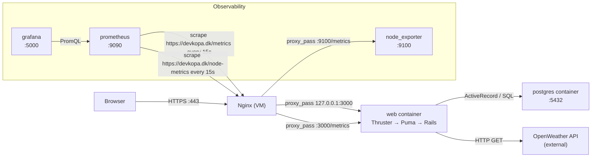
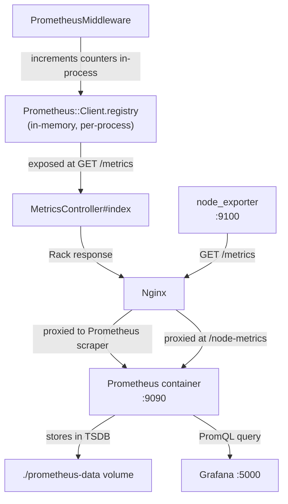
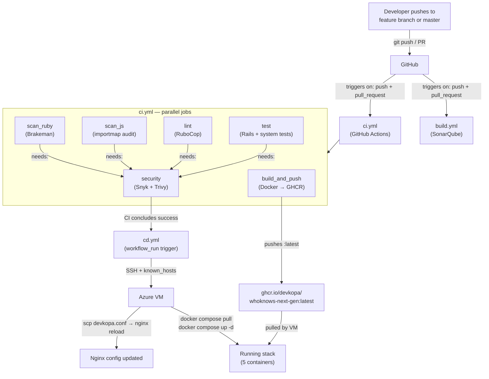
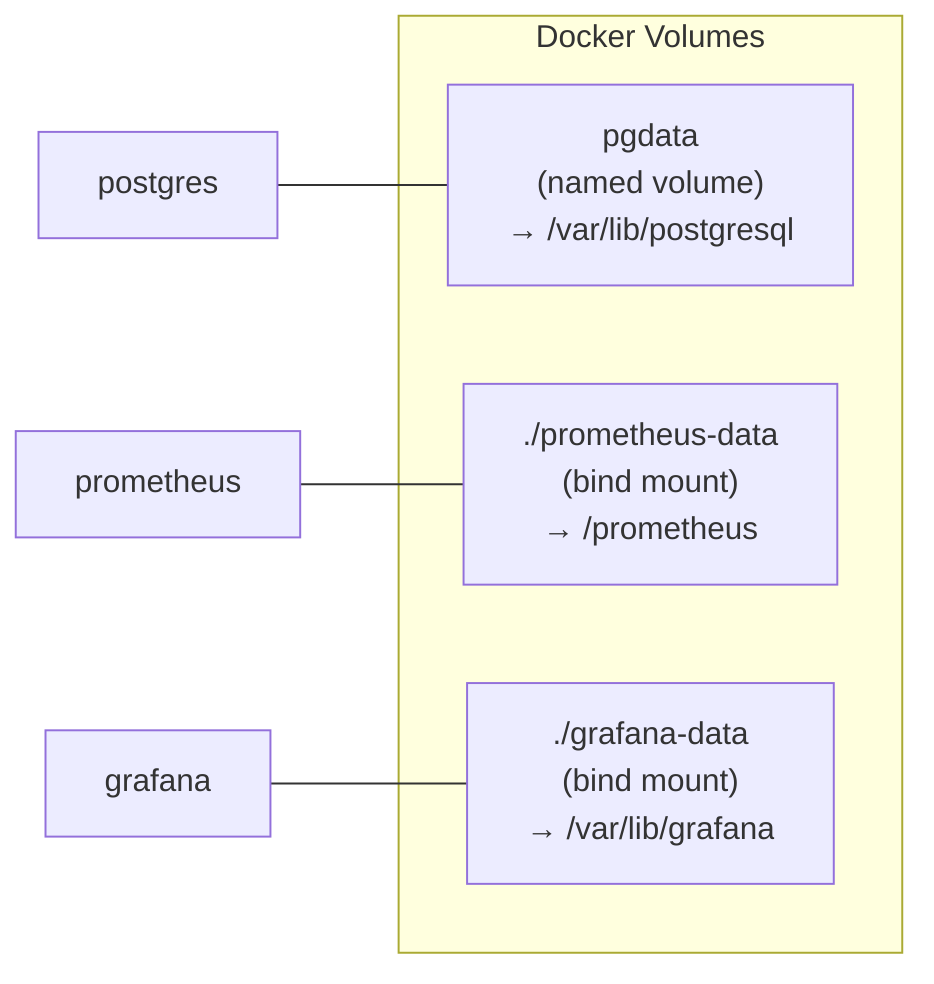
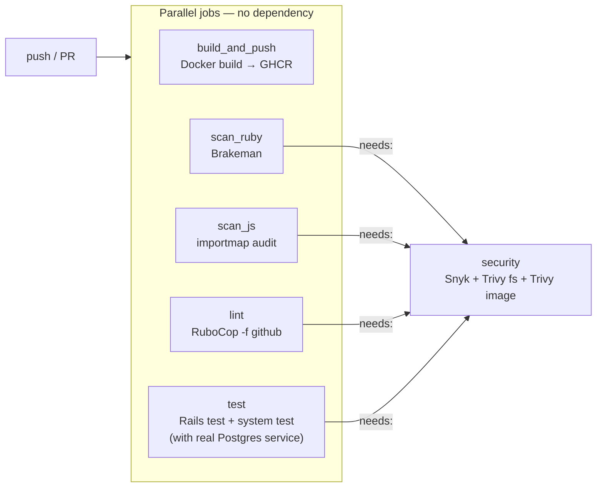
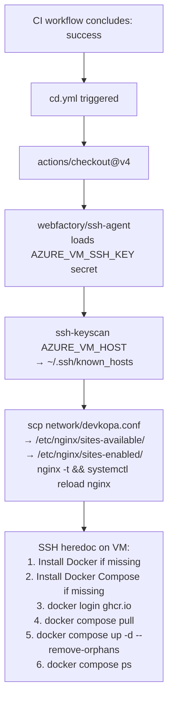
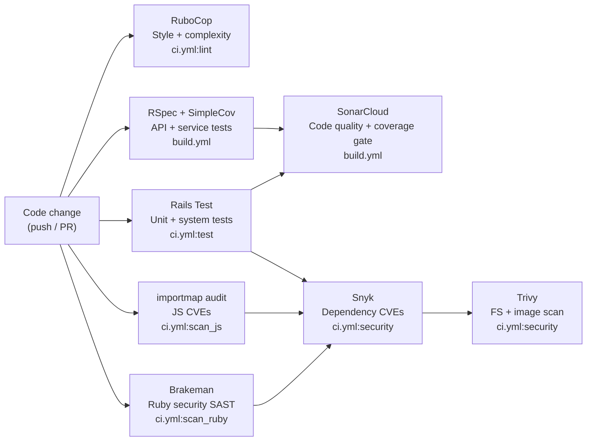

# WhoKnows DevOps Exam Study Guide

> All explanations are grounded in the **WhoKnows-next-gen** repository.  
> Secrets are referenced by name only — never by value.

---

## Table of Contents

1. [End-to-End System Narrative](#1-end-to-end-system-narrative)
2. [Component Catalog](#2-component-catalog)
3. [DevOps Planes: Build / CI · Release / CD · Run / Ops](#3-devops-planes)
4. [Quality & Security Story](#4-quality--security-story)
5. [Gaps vs exam_project_requirements.md](#5-gaps-vs-exam_project_requirementsmd)
6. [Exam Crib Sheet — 20 Q&A](#6-exam-crib-sheet--20-qa)

---

## 1. End-to-End System Narrative

### 1.1 Architecture Overview

The WhoKnows stack has two layers:

- **VM layer** (Azure VM, outside Docker): Nginx handles all public traffic — TLS termination, HTTP→HTTPS redirect, and reverse-proxying to every internal service.
- **Container layer** (Docker Compose): Rails app, PostgreSQL, Prometheus, Grafana, Node Exporter.



### 1.2 Request Path — Step by Step

**A user searches for "Copenhagen":**

1. **Browser → Nginx (`:443`)**  
   The browser sends `GET https://devkopa.dk/api/search?q=Copenhagen`.  
   Nginx (`network/devkopa.conf`) terminates TLS with Let's Encrypt certs at `/etc/letsencrypt/live/devkopa.dk/`. HTTP requests on `:80` get a `301` redirect to HTTPS.

2. **Nginx → Thruster (`:3000`)**  
   Nginx `proxy_pass`es to `http://127.0.0.1:3000`, forwarding `X-Forwarded-For`, `X-Forwarded-Proto`, and `Host` headers.

3. **Thruster → Puma**  
   Thruster (`bin/thrust`) is a lightweight HTTP/2 reverse proxy that wraps Puma. It handles HTTP/2 multiplexing and asset compression. The container `CMD` is `./bin/thrust ./bin/rails server` (see `Dockerfile` line 74).

4. **Puma → Rack Middleware Stack**  
   Puma passes the request through the Rack middleware chain. `PrometheusMiddleware` (`app/middleware/prometheus_middleware.rb`) intercepts every request (except `/metrics` itself), records start time, calls the next middleware, then increments `HTTP_REQUESTS_TOTAL` and observes `HTTP_REQUEST_DURATION` with `method`, `path`, and `status` labels. Paths with numeric IDs are normalized (e.g. `/users/123` → `/users/:id`) to avoid high-cardinality label explosion.

5. **Rails Controller → Service → Repository → DB**  
   The router (`config/routes.rb`) dispatches to `Api::SearchController`. The search service queries the `pages` table using `pg_trgm` trigram similarity via a GIN index on both `content` and `title` columns (see `db/schema.rb` lines 33–34). Results are capped at 100. The query is logged to `search_logs`.

6. **Response path**  
   JSON response travels back: Rails → Puma → Thruster → Nginx → Browser.

**Failure mode:** If `postgres` container is down, Rails raises `ActiveRecord::ConnectionNotEstablished`. The `/health/ready` endpoint checks DB connectivity and returns `503`, which Prometheus will detect as a scrape failure. You'd debug with `docker compose logs postgres` and `docker compose ps`.

---

### 1.3 Metrics Path



**Custom metrics defined in `config/initializers/prometheus.rb`:**

| Metric name | Type | Labels | What it tracks |
|---|---|---|---|
| `http_requests_total` | Counter | `method`, `path`, `status` | Every HTTP request |
| `http_request_duration_seconds` | Histogram | `method`, `path` | Request latency distribution |
| `user_registrations_total` | Gauge | — | Total registered users |
| `user_logins_total` | Counter | `status` | Login attempts (success/fail) |
| `weather_requests_total` | Counter | — | Weather API calls |
| `search_requests_total` | Counter | — | Search queries |
| `password_changes_total` | Counter | `status` | Password change attempts |

**Node Exporter** collects host OS metrics: CPU usage, memory, disk per mount, network bytes in/out, load average. It runs with `pid: host` and a read-only bind mount of `/` so it can read `/proc` and `/sys` from the host.

---

### 1.4 Deploy Path



**Key sequencing facts:**
- `build_and_push` and the quality jobs run **in parallel** — the image is pushed to GHCR even if a quality job fails, but `cd.yml` only triggers when the **entire** `ci.yml` workflow concludes `success`.
- `security` job has `needs: [scan_ruby, scan_js, lint, test]` — it only runs after all four pass.
- `build.yml` (SonarQube) is **independent** — it runs its own Postgres service container, runs RSpec with SimpleCov, and uploads `coverage/coverage.xml` to SonarCloud. It does not gate the deploy.
- `concurrency: cancel-in-progress: true` in `ci.yml` cancels any in-flight run on the same ref when a new push arrives.

---

## 2. Component Catalog

### 2.1 Service Table

| Service | Image | Host Port → Container Port | Config source | Responsibility |
|---|---|---|---|---|
| `web` | `ghcr.io/devkopa/whoknows-next-gen:latest` | `3000 → 80` | `.env`, `credentials.yml.enc` | Rails 8 app; Thruster wraps Puma; serves HTML, JSON API, `/metrics`, `/health*` |
| `postgres` | `postgres:latest` | `5432 → 5432` | `.env` (`POSTGRES_USER`, `POSTGRES_PASSWORD`, `POSTGRES_DB`) | Relational store: `users`, `pages`, `search_logs`, `weather_searches`; GIN/trigram indexes |
| `node_exporter` | `prom/node-exporter:latest` | `9100 → 9100` | `docker-compose.yml` (`pid: host`, `/:/host:ro`) | Exports host OS metrics: CPU, memory, disk, network, load average |
| `prometheus` | `prom/prometheus:latest` | `9090 → 9090` | `./prometheus.yml` (bind mount) | Scrapes `/metrics` and `/node-metrics` every 15s; stores in TSDB at `./prometheus-data` |
| `grafana` | `grafana/grafana-oss:latest` | `5000 → 3000` | `.env` (Grafana admin creds), `./grafana-data` | Dashboard UI; queries Prometheus via PromQL; state persisted in `./grafana-data` |
| Nginx (VM, not Docker) | `nginx` (system) | `80, 443` | `network/devkopa.conf` | TLS termination (Let's Encrypt), HTTP→HTTPS redirect, reverse proxy for all services |

### 2.2 Volume & Network Map



All services share the default Docker Compose bridge network. The `web` container's port `80` is mapped to host `3000`. Nginx (on the VM host) reaches containers via `127.0.0.1:<host-port>`.

### 2.3 Per-Service Deep Dive

#### `web` — Rails + Thruster + Puma

**What it is:** Ruby on Rails 8 application. Thruster is a Go-based HTTP/2 reverse proxy (from Basecamp) that sits in front of Puma and adds HTTP/2, asset compression, and X-Sendfile support. Puma is the multi-threaded Ruby application server.

**Why this stack:** Rails generates the Dockerfile with Thruster by default since Rails 8. Puma handles concurrent Ruby requests; Thruster handles the HTTP/2 protocol layer efficiently without requiring Nginx inside the container.

**Startup sequence (`bin/docker-entrypoint`):**
1. Finds `libjemalloc.so.2` and sets `LD_PRELOAD` — jemalloc reduces Ruby heap fragmentation and memory usage.
2. If the last two args are `./bin/rails server`, runs `rails db:prepare` — creates the DB if missing, runs pending migrations.
3. `exec`s the CMD: `./bin/thrust ./bin/rails server`.

**Failure mode:** Container exits with code 1 at startup → usually a bad `RAILS_MASTER_KEY` (can't decrypt `credentials.yml.enc`) or DB not ready. Debug: `docker compose logs web`. If it's a DB timing issue, `depends_on: postgres` only waits for the container to start, not for Postgres to be ready — add a retry loop or use `healthcheck` in compose.

**Dockerfile multi-stage build:**

```
Stage: base   → ruby:3.4.5-slim + runtime packages (curl, libjemalloc2, libvips)
Stage: build  → base + build tools (gcc, git, libyaml) → bundle install → bootsnap precompile → assets:precompile
Stage: final  → base + copy gems + app from build stage → non-root user (rails:1000)
```

The final image has no compiler, no build tools, no gem source cache — only what's needed to run. The non-root user (`USER 1000:1000`) limits blast radius if the container is compromised.

---

#### `postgres` — PostgreSQL

**What it is:** The relational database. All credentials come from `.env` via `env_file`.

**Schema highlights (`db/schema.rb`):**
- `pages` — the search corpus. Primary key is `title` (text). GIN indexes on `content` and `title` using `gin_trgm_ops` (trigram similarity). The `pg_trgm` extension enables `LIKE '%query%'` to use these indexes.
- `users` — auth table. Has both `password` (legacy) and `password_digest` (bcrypt). Unique indexes on `username` and `email`.
- `search_logs` — records every search query + IP for analytics/metrics.
- `weather_searches` — records weather lookups + IP.
- `_prisma_migrations` — leftover from the legacy stack migration; not used by Rails.

**Connection pool:** `config/database.yml` sets `pool: RAILS_MAX_THREADS` (default 5). Puma threads × pool size must be balanced to avoid connection exhaustion.

**Failure mode:** If `pgdata` volume is corrupted or the container crashes mid-write, you may get a dirty WAL. Recovery: `docker compose stop postgres`, inspect the volume, restore from backup using `scripts/restore_database.sh`.

---

#### `node_exporter` — Host Metrics

**What it is:** A Prometheus exporter that reads Linux kernel metrics from `/proc` and `/sys`. Runs with `pid: host` (shares the VM's PID namespace) and mounts the host root filesystem read-only at `/host`.

**Why outside the app container:** The app container only knows about itself. Node Exporter needs host-level visibility to report CPU, memory, disk, and network for the entire VM.

**Failure mode:** If the container stops, Prometheus scrape of `/node-metrics` fails. Grafana panels for CPU/memory/disk will show "No data". Debug: `docker compose ps node_exporter`, `docker compose logs node_exporter`.

---

#### `prometheus` — Metrics Store

**What it is:** A time-series database and scraper. Pulls metrics from configured targets on a schedule and stores them in a local TSDB (time-series database).

**Scrape config (`prometheus.yml`):**
```yaml
global:
  scrape_interval: 15s

scrape_configs:
- job_name: node-exporter
  static_configs:
    - targets: [devkopa.dk]
  metrics_path: /node-metrics
  scheme: https

- job_name: rails-app
  static_configs:
    - targets: [devkopa.dk]
  metrics_path: /metrics
  scheme: https
```

Both jobs scrape through `devkopa.dk` (Nginx) over HTTPS. This means Prometheus uses the public domain even when running on the same VM — Nginx routes it back to the local services.

**Failure mode:** If Prometheus can't reach `devkopa.dk/metrics` (e.g. Nginx is down), scrapes fail silently — metrics stop updating. Check Prometheus UI at `http://localhost:9090/targets` (or `https://devkopa.dk/prometheus/`) to see target health.

---

#### `grafana` — Dashboards

**What it is:** A visualization platform. Queries Prometheus via PromQL and renders time-series dashboards.

**Port mapping:** Host `5000` → container `3000` (Grafana's default internal port). Nginx proxies `https://devkopa.dk/grafana/` to `http://127.0.0.1:5000/`.

**State persistence:** `./grafana-data` bind mount stores dashboards, data source configs, and the installed `grafana-metricsdrilldown-app` plugin. If this directory is deleted, all dashboards are lost.

**Failure mode:** Grafana shows "datasource not found" → the Prometheus data source URL is misconfigured. Should point to `http://prometheus:9090` (Docker service name) or `http://localhost:9090` depending on network config.

---

#### Nginx — Reverse Proxy (VM, not Docker)

**What it is:** The VM's system Nginx acts as the single public entry point. It is deployed by `cd.yml` (the workflow SCPs `network/devkopa.conf` to `/etc/nginx/sites-available/` and reloads Nginx).

**What it does (`network/devkopa.conf`):**

| Location | Proxies to | Purpose |
|---|---|---|
| `:80` all | — | `301` redirect to HTTPS |
| `:443 /` | `127.0.0.1:3000` | Rails app |
| `:443 /prometheus/` | `127.0.0.1:9090/` | Prometheus UI + API |
| `:443 /grafana/` | `127.0.0.1:5000/` | Grafana dashboards |
| `:443 /node-metrics` | `127.0.0.1:9100/metrics` | Node Exporter (for Prometheus scraping) |
| `:443 /nginx-health` | inline `200 ok` | Nginx self-health check |

TLS uses Let's Encrypt certs (`/etc/letsencrypt/live/devkopa.dk/`). TLSv1.2 and TLSv1.3 only; weak ciphers excluded.

**Failure mode:** Nginx config syntax error after a deploy → `nginx -t` fails, `systemctl reload nginx` is skipped (the `|| true` in `cd.yml` means the deploy continues but Nginx isn't updated). Check with `sudo nginx -t` on the VM.

---

## 3. DevOps Planes

### 3.1 Build / CI — `ci.yml` + `build.yml`

**Definition:** CI (Continuous Integration) means every code change is automatically integrated, built, and verified. The goal is to catch problems fast and always have a known-good artifact.

#### `ci.yml` — The main CI pipeline

**Triggers:** `on: push` (all branches) + `on: pull_request`.  
**Concurrency:** `cancel-in-progress: true` — if you push twice quickly, the older run is cancelled.



**Job details:**

| Job | Key steps | What fails it |
|---|---|---|
| `build_and_push` | `docker build` → `docker push ghcr.io/devkopa/whoknows-next-gen:latest` | Build error, GHCR auth failure |
| `scan_ruby` | `bin/brakeman --no-pager` | Any Brakeman finding (SQL injection, XSS, CSRF, etc.) |
| `scan_js` | `bin/importmap audit` | Known CVE in a JS import |
| `lint` | `bin/rubocop -f github` | RuboCop style/complexity violation |
| `test` | `bin/rails db:test:prepare test test:system` | Failing unit, integration, or system test |
| `security` | `snyk test` + `trivy fs .` + `trivy image whoknows-next-gen:ci` | CVE above threshold in deps or image |

The `test` job spins up a real `postgres:18` service container and waits for it with `pg_isready`. On failure, screenshots from system tests are uploaded as artifacts.

#### `build.yml` — SonarQube / coverage pipeline

**Triggers:** Same as `ci.yml` — push + PR.  
**Independent** — does not gate the deploy, runs in parallel with `ci.yml`.

**Steps:**
1. Checkout with `fetch-depth: 0` (full history — SonarQube needs it for blame annotations).
2. Spin up `postgres:18` service container.
3. `bundle install` + `bin/rails db:create db:schema:load`.
4. `bundle exec rspec` — runs all RSpec specs, SimpleCov generates `coverage/coverage.xml`.
5. Verify `coverage/coverage.xml` exists and is non-empty.
6. `SonarSource/sonarqube-scan-action@v7` uploads to `sonarcloud.io` using `SONAR_TOKEN`.

`sonar-project.properties` tells SonarCloud: sources are `app,lib`, tests are `spec`, coverage report is `coverage/coverage.xml`.

---

### 3.2 Release / CD — `cd.yml`

**Definition:** CD here is **Continuous Deployment** — every successful CI run automatically deploys to production with no manual approval gate.

**Trigger:** `on: workflow_run` — fires when the `CI` workflow completes. The `deploy` job has `if: github.event.workflow_run.conclusion == 'success'` — it only runs if CI passed.

**Deploy steps:**



**Key design decisions:**
- The Nginx config is version-controlled in `network/devkopa.conf` and deployed on every CD run — infrastructure-as-code for the proxy layer.
- `docker compose up -d --remove-orphans` removes containers for services that no longer exist in `docker-compose.yml`.
- The CD script self-bootstraps Docker and Docker Compose if they're missing — idempotent first-run setup.
- `config/deploy.yml` is a **Kamal** template with placeholder values (`192.168.0.1`, `your-user`). Kamal is **not** the active deploy mechanism — it was scaffolded by Rails but not configured. The actual deploy is the SSH + Docker Compose approach.

**Secrets used in CD:**

| Secret name | Purpose |
|---|---|
| `AZURE_VM_SSH_KEY` | Private key for SSH into the Azure VM |
| `AZURE_VM_HOST` | VM hostname/IP |
| `AZURE_VM_USER` | SSH username |
| `AZURE_VM_APP_PATH` | Path on VM where `docker-compose.yml` lives |
| `AZURE_VM_GHCR_PAT` | Personal Access Token to pull from GHCR |

---

### 3.3 Run / Ops

**Definition:** The operational plane — what keeps the system running, observable, and recoverable after deployment.

#### Health Checks

Defined in `config/routes.rb` and served by `HealthController`:

| Endpoint | What it checks | Use case |
|---|---|---|
| `/health` | Basic — app is responding | Load balancer probe |
| `/health/ready` | Readiness — DB connectivity | Kubernetes/orchestrator readiness probe |
| `/health/live` | Liveness — process is alive | Kubernetes liveness probe |
| `/health/metrics` | Metrics summary | Quick ops dashboard |
| `/up` | Rails built-in (silenced in logs) | Thruster/Puma health |

#### Monitoring Stack

Prometheus → Grafana pipeline:
1. Prometheus scrapes every 15s (configured in `prometheus.yml`).
2. Data stored in `./prometheus-data` (bind mount, persists across restarts).
3. Grafana reads from Prometheus via PromQL. Dashboards and plugin state in `./grafana-data`.
4. Accessible at `https://devkopa.dk/grafana/` (via Nginx proxy).

Tracked metrics (from README):
- Uptime %, uptime weeks
- User logins, user registrations
- Weather API requests
- Search requests, search match rate
- CPU usage %, per-CPU idle rate
- Memory usage %
- Disk usage % per mount
- Network traffic bytes/s in vs out
- Load average 1m / 5m / 15m

#### Database Backup & Restore

Scripts in `scripts/`:

| Script | Platform | What it does |
|---|---|---|
| `backup_database.sh` | Linux/macOS | `docker exec postgres pg_dump` → gzip → `./backups/whoknows_backup_<timestamp>.sql.gz` |
| `backup_database.ps1` | Windows | Same via PowerShell |
| `restore_database.sh` | Linux/macOS | Gunzip + `docker exec postgres psql` to restore |
| `restore_database.ps1` | Windows | Same via PowerShell |
| `verify_backup.ps1` | Windows | Checks backup file integrity |
| `setup_backup_schedule.ps1` | Windows | Registers Windows Task Scheduler job |
| `scheduled_backup.ps1` | Windows | The scheduled task script itself |

Linux cron equivalent: `0 2 * * * /bin/bash /path/to/scripts/backup_database.sh`.

#### Dependency Automation

`.github/dependabot.yml` configures Dependabot to open PRs daily for:
- `bundler` (Ruby gems) — max 10 open PRs
- `github-actions` (workflow action versions) — max 10 open PRs

This means security patches for gems and actions are surfaced automatically without manual monitoring of CVE feeds.

---

## 4. Quality & Security Story

### 4.1 Quality Gates Map



### 4.2 Tool-by-Tool Breakdown

#### RuboCop — Ruby Linter

**What it is:** Static analysis tool for Ruby. Enforces style (indentation, naming), complexity (method length, ABC size), and best practices.

**Where:** `bin/rubocop` (binstub), runs in `ci.yml:lint` as `bin/rubocop -f github` (GitHub-formatted output for inline PR annotations).

**Why it matters for exam:** Demonstrates "software quality" requirement. RuboCop is the Ruby equivalent of ESLint or Checkstyle. The `-f github` flag makes violations appear as inline comments on PRs.

**Failure mode:** A method is too long or a variable is named poorly → CI fails. Fix: run `bin/rubocop -a` locally for auto-corrections.

---

#### Brakeman — Ruby Security SAST

**What it is:** Static Application Security Testing (SAST) tool specific to Rails. Detects: SQL injection, cross-site scripting (XSS), cross-site request forgery (CSRF), mass assignment vulnerabilities, unsafe redirects, command injection.

**Where:** `bin/brakeman`, runs in `ci.yml:scan_ruby` as `bin/brakeman --no-pager`.

**README claims:** "Zero security vulnerabilities (Brakeman scan)" — this is a quality signal you can point to in the exam.

**Failure mode:** A new controller action uses `params` directly in a SQL query → Brakeman flags SQL injection → CI fails. Fix: use ActiveRecord parameterized queries.

---

#### importmap audit — JS Dependency CVE Scan

**What it is:** Rails 8 uses importmap instead of npm/webpack. `bin/importmap audit` checks the import map's pinned JavaScript packages against known CVE databases.

**Where:** `ci.yml:scan_js`.

**Why it matters:** No `package.json` or `node_modules` in this project — importmap is the JS dependency manager. This is the equivalent of `npm audit`.

---

#### Rails Test (Minitest) — Unit + System Tests

**What it is:** Rails' built-in test framework (Minitest). The `test/` directory contains:
- `test/models/search_log_test.rb` — model tests
- `test/application_system_test_case.rb` — system test base class
- `test/fixtures/search_logs.yml` — test data fixtures

**System tests** use a real browser (Google Chrome installed in CI via `google-chrome-stable`). They test end-to-end user flows. On failure, screenshots are uploaded as CI artifacts.

**Command:** `bin/rails db:test:prepare test test:system` — prepares the test DB, runs unit tests, then system tests.

---

#### RSpec + SimpleCov — Coverage-Tracked Tests

**What it is:** RSpec is an alternative Ruby test framework with a more expressive DSL. SimpleCov measures code coverage.

**Where:** `spec/` directory contains tests for: requests (API), services, middleware (`PrometheusMiddleware`), repositories, models, lib.

**Coverage output:** `coverage/coverage.xml` (Cobertura format) — consumed by SonarCloud.

**Command:** `bundle exec rspec` (in `build.yml`).

---

#### SonarCloud — Code Quality + Coverage Gate

**What it is:** Cloud-hosted code quality platform. Analyzes code for bugs, code smells, security hotspots, and tracks test coverage over time.

**Integration:**
- `sonar-project.properties` defines: `sonar.projectKey=devkopa-1_WhoKnows-next-gen`, `sonar.sources=app,lib`, `sonar.tests=spec`, `sonar.coverageReportPaths=coverage/coverage.xml`.
- `build.yml` uses `SonarSource/sonarqube-scan-action@v7` with `SONAR_TOKEN` secret.
- `SONAR_HOST_URL=https://sonarcloud.io`.

**Exam tip:** The teacher specifically mentions SonarCloud in `exam_presentation_requirements.md` — show it interacting with a PR, not just the dashboard.

---

#### Snyk — Dependency CVE Scanning

**What it is:** Commercial (free tier) dependency vulnerability scanner. Checks `Gemfile.lock` against Snyk's CVE database.

**Where:** `ci.yml:security` — runs after all other quality jobs pass (`needs: [scan_ruby, scan_js, lint, test]`).

**Commands:** `snyk auth $SNYK_TOKEN` → `snyk test`.

**Failure mode:** A gem has a known CVE → `snyk test` exits non-zero → CI fails. Fix: update the gem in `Gemfile` and run `bundle update`.

---

#### Trivy — Container + Filesystem Scanner

**What it is:** Open-source vulnerability scanner from Aqua Security. Scans: filesystem (source code + deps), Docker image layers.

**Where:** `ci.yml:security`, after Snyk.

**Commands:**
- `trivy fs .` — scans the repository filesystem.
- `docker build -t whoknows-next-gen:ci .` + `trivy image whoknows-next-gen:ci` — builds the image locally and scans all layers.

**Why two scans:** `fs` catches source-level issues; `image` catches OS-level packages installed in the base image (`ruby:3.4.5-slim`).

---

#### Dependabot — Automated Dependency Updates

**What it is:** GitHub's built-in dependency update bot. Opens PRs automatically when newer versions of dependencies are available.

**Config (`.github/dependabot.yml`):**
- `bundler` ecosystem, daily, max 10 PRs — keeps Ruby gems current.
- `github-actions` ecosystem, daily, max 10 PRs — keeps workflow action versions current.

**Why it matters:** Reduces the window between a CVE being published and the project updating the vulnerable package.

---

### 4.3 Security Hardening in Production

**`config/environments/production.rb`:**

| Setting | Value | Effect |
|---|---|---|
| `config.force_ssl` | `true` | Rails redirects HTTP → HTTPS; sets HSTS header |
| `config.assume_ssl` | `true` | Trusts `X-Forwarded-Proto: https` from Nginx |
| `config.hosts` | `devkopa.dk`, `www.devkopa.dk`, `localhost`, `127.0.0.1` | Allowlist prevents DNS rebinding attacks |
| `config.log_level` | `info` (default) | Avoids logging sensitive request params |

**Nginx (`network/devkopa.conf`):**
- TLSv1.2 + TLSv1.3 only (`ssl_protocols TLSv1.2 TLSv1.3`)
- Weak ciphers excluded (`ssl_ciphers HIGH:!aNULL:!MD5`)
- `Content-Security-Policy` header on all responses

**Application-level:**
- Passwords stored as bcrypt digests (`password_digest` column, `has_secure_password` in Rails)
- Session cookies: httponly (Rails default, prevents JS access)
- CSRF protection: Rails `protect_from_forgery` (default on)
- Email validation with RFC compliance (per README)
- Minimum 8-character passwords enforced

**Secrets management:**
- `.env` file is gitignored — never committed
- `credentials.yml.enc` is encrypted with `RAILS_MASTER_KEY` (stored in GitHub Secrets)
- All CI/CD secrets stored in GitHub repository secrets, injected as environment variables

---

## 5. Gaps vs exam_project_requirements.md

### 5.1 Technology Requirements

| Requirement | Status | Evidence / Notes |
|---|---|---|
| Rewrite server in non-Flask/Express/Spring Boot framework | **Satisfied** | Ruby on Rails 8 |
| Use version control | **Satisfied** | Git + GitHub (`github.com/devkopa/WhoKnows-next-gen`) |
| Employ a branching strategy | **Partially satisfied** — CI runs on all branches + PRs, but no explicit strategy document exists | Be ready to describe: feature branches → PR → merge to `master`. Trunk-based development. |
| Have a way to manage issues | **Satisfied** | GitHub Issues with templates: `bug_report.yml`, `feature_request.yml`, `general.yml` |
| Create thorough documentation | **Satisfied** | `README.md`, `docs/API.md`, `docs/MAINTENANCE.md`, `docs/MAINTENANCE_SUMMARY.md`, `Mandatory I/openapispecification.yaml`, `swagger/v1/swagger.yaml`, `postman-collection.json` |
| Ensure software quality (static analysis / linting) | **Satisfied** | RuboCop (linting) + Brakeman (SAST) + SonarCloud (quality gate) |
| Perform testing | **Satisfied** | Rails Minitest (unit + system) + RSpec (API, services, middleware, repos) |
| Setup a CI/CD pipeline | **Satisfied** | `ci.yml` (CI) + `cd.yml` (CD) + `build.yml` (SonarQube) |
| Have monitoring | **Satisfied** | Prometheus + Grafana + Node Exporter + 7 custom application metrics |
| Deploy to VM (not PaaS) | **Satisfied** | Azure VM, Docker Compose, deployed via SSH in `cd.yml` |
| Discuss scaling + optimal deployment strategy | **Unclear** — no scaling document found in repo | Must be covered in exam report or presentation. See scaling notes below. |
| System deployed for exam | **Needs verification** — depends on Azure VM credit and `devkopa.dk` DNS being live | Check before exam day. Have a fallback (local `docker compose up`). |

### 5.2 DevOps Culture Requirements

| Requirement | Status | Notes |
|---|---|---|
| DevOps as culture, not just tooling | **Needs articulation** | Prepare a 30-second answer: "DevOps is about shared ownership of the entire delivery pipeline — dev and ops working together, fast feedback loops, psychological safety to fail and learn. Our pipelines automate the feedback, but the culture is us reviewing each other's PRs, responding to monitoring alerts together, and doing post-mortems." |
| Commit activity / participation | **Needs review** | Teacher generates commit graphs. Be ready to discuss honestly. If uneven, frame it as a learning experience about team dynamics. |
| Psychological safety | **Needs preparation** | If there were team issues, the exam requirement is to bring them up proactively — this is seen as maturity, not weakness. |

### 5.3 Scaling Discussion (Exam Preparation)

Since no scaling document exists in the repo, prepare to discuss:

**Current single-node limitations:**
- One `web` container on one VM — vertical scaling only (bigger VM).
- `postgres` is a single container — no read replicas, no connection pooling middleware (PgBouncer).
- Prometheus TSDB is local — no HA.

**Horizontal scaling options (what you'd do next):**
- Multiple `web` containers behind a load balancer (Nginx upstream block or a managed LB).
- PostgreSQL read replicas for search queries (read-heavy workload).
- Move Prometheus to a managed service (Grafana Cloud) or add Thanos for HA.
- Container orchestration: Kubernetes (or Docker Swarm) to auto-scale `web` replicas based on CPU/request rate.

**Optimal deployment strategy discussion:**
- Current: `docker compose` on a single VM — simple, low operational overhead, appropriate for this scale.
- Next step: Kamal (already scaffolded in `config/deploy.yml`) — zero-downtime deploys with health checks, rolling updates.
- At scale: Kubernetes with Helm charts, horizontal pod autoscaling.

---

## 6. Exam Crib Sheet — 20 Q&A

> Target: answer each in 30–60 seconds. All answers anchored to WhoKnows-next-gen.

---

**Q1. What is DevOps?**

DevOps is a culture of shared responsibility between development and operations teams, aiming for fast, reliable software delivery through automation, collaboration, and continuous feedback. It is **not** the tools — Docker, Prometheus, and GitHub Actions are enablers. In WhoKnows, we embody DevOps by: owning the full pipeline from code to production monitoring, automating every quality gate in CI, and using Grafana dashboards so the whole team can see production health.

---

**Q2. What is CI and what does it do in WhoKnows?**

Continuous Integration means every code change is automatically built, tested, and verified. In WhoKnows, `ci.yml` triggers on every push and PR. It runs in parallel: builds the Docker image and pushes to GHCR, runs RuboCop (lint), Brakeman (security SAST), importmap audit (JS CVEs), Rails tests (unit + system), and finally Snyk + Trivy (dependency + image CVE scans). If any job fails, the image is not deployed.

---

**Q3. What is the difference between Continuous Delivery and Continuous Deployment?**

**Continuous Delivery** = automated pipeline produces a production-ready artifact, but a human approves the final deploy step.  
**Continuous Deployment** = fully automated all the way to production — no human gate.  
WhoKnows uses **Continuous Deployment**: `cd.yml` fires automatically when `ci.yml` concludes with `success`. No one clicks "approve deploy."

---

**Q4. How does the Docker image get built and where does it live?**

`ci.yml`'s `build_and_push` job runs `docker build -t ghcr.io/devkopa/whoknows-next-gen:latest .` and pushes to GitHub Container Registry (GHCR). The `cd.yml` workflow then SSHes into the Azure VM and runs `docker compose pull` to fetch the new `:latest` image before restarting containers.

---

**Q5. What is Thruster and why is it in the stack?**

Thruster is a lightweight Go-based HTTP/2 reverse proxy from Basecamp that wraps Puma. It handles HTTP/2 multiplexing, response compression, and X-Sendfile support, so Puma can focus purely on Ruby request processing. The container `CMD` is `./bin/thrust ./bin/rails server` — Thruster is the outermost layer inside the container, Puma is the inner layer.

---

**Q6. What does the Dockerfile's multi-stage build achieve?**

It separates build-time tools from the runtime image. Stage 1 (`build`) has gcc, git, libyaml — needed to compile native gems and precompile assets. Stage 2 (final) copies only the compiled gems and application code. No build tools ship in the production image. Result: smaller attack surface, smaller image size. The final image also runs as a non-root user (`rails:1000`) for additional security.

---

**Q7. What does `bin/docker-entrypoint` do and why does it matter?**

It does two things: (1) sets `LD_PRELOAD` to jemalloc, which reduces Ruby memory fragmentation and improves latency; (2) runs `rails db:prepare` before starting the server — this creates the database if it doesn't exist and runs any pending migrations. This means schema changes deploy automatically with the container, with no separate migration step.

---

**Q8. What is Nginx's role and why does it run on the VM instead of in Docker?**

Nginx is the single public entry point. It handles TLS termination (Let's Encrypt certs), HTTP→HTTPS redirect, and reverse-proxying to the Rails app, Prometheus, Grafana, and Node Exporter. It runs on the VM (not in Docker) because it needs to bind to ports 80 and 443 on the public interface and hold the TLS certificates. The config (`network/devkopa.conf`) is version-controlled and deployed automatically by `cd.yml`.

---

**Q9. How does Prometheus collect metrics from WhoKnows?**

Prometheus scrapes `https://devkopa.dk/metrics` every 15 seconds (configured in `prometheus.yml`). Nginx proxies this to the Rails app's `/metrics` endpoint. Inside Rails, `PrometheusMiddleware` instruments every request (recording counts and durations), and `config/initializers/prometheus.rb` defines custom counters for logins, registrations, weather requests, and searches. The `prometheus-client` gem exposes all registered metrics in the Prometheus text format at `/metrics`.

---

**Q10. What does Node Exporter do and how is it exposed?**

Node Exporter is a Prometheus exporter that reads host OS metrics from `/proc` and `/sys` — CPU, memory, disk per mount, network bytes in/out, load average. It runs as a Docker container with `pid: host` (shares the VM's PID namespace) and mounts the host root at `/host:ro`. Prometheus scrapes it via `https://devkopa.dk/node-metrics`, which Nginx proxies to `127.0.0.1:9100/metrics`.

---

**Q11. What is the database schema and how is search implemented?**

Four tables: `users` (auth), `pages` (search corpus), `search_logs` (query analytics), `weather_searches` (weather analytics). The `pages` table has GIN indexes on both `content` and `title` using `gin_trgm_ops` — this is PostgreSQL's trigram similarity extension (`pg_trgm`), which makes `LIKE '%query%'` searches use an index instead of a full table scan. Results are capped at 100. The `pg_trgm` extension is enabled in `schema.rb`.

---

**Q12. How are secrets managed in WhoKnows?**

Three layers: (1) `.env` file for local development — gitignored, never committed; (2) GitHub Secrets for CI/CD — `POSTGRES_USER`, `POSTGRES_PASSWORD`, `RAILS_MASTER_KEY`, `SNYK_TOKEN`, `AZURE_VM_SSH_KEY`, etc.; (3) `credentials.yml.enc` — Rails encrypted credentials file, decrypted at runtime using `RAILS_MASTER_KEY`. No secrets are hardcoded in any file.

---

**Q13. What security scans run in CI and what do they each catch?**

Four layers in `ci.yml`:
1. **Brakeman** — Ruby SAST: SQL injection, XSS, CSRF, mass assignment in Rails code.
2. **importmap audit** — CVEs in JavaScript imports (no npm, so this is the JS equivalent of `npm audit`).
3. **Snyk** — CVEs in Ruby gem dependencies (`Gemfile.lock`).
4. **Trivy** — two scans: `trivy fs .` (source + deps) and `trivy image` (Docker image layers, including base OS packages).

---

**Q14. What is SonarCloud and how is it integrated?**

SonarCloud is a cloud-based code quality platform. `build.yml` runs RSpec with SimpleCov to produce `coverage/coverage.xml` (Cobertura format), then the `SonarSource/sonarqube-scan-action` uploads it to `sonarcloud.io`. `sonar-project.properties` configures the project key, source paths (`app,lib`), test paths (`spec`), and coverage report path. SonarCloud then tracks code smells, bugs, security hotspots, and coverage trends over time.

---

**Q15. What is Dependabot and what does it automate here?**

Dependabot is GitHub's automated dependency update bot. In `.github/dependabot.yml`, it's configured to run daily for `bundler` (Ruby gems) and `github-actions` (workflow action versions), opening up to 10 PRs each. This means when a gem gets a security patch, Dependabot opens a PR automatically — the team just needs to review and merge it.

---

**Q16. How does the CD pipeline deploy to the Azure VM?**

`cd.yml` triggers when `ci.yml` succeeds. It: (1) loads the SSH private key (`AZURE_VM_SSH_KEY`) via `webfactory/ssh-agent`; (2) adds the VM to `known_hosts` via `ssh-keyscan`; (3) SCPs `network/devkopa.conf` to the VM and reloads Nginx; (4) SSHes into the VM and runs a heredoc script that pulls the new image from GHCR and runs `docker compose up -d --remove-orphans`. The entire deploy is automated — no manual steps.

---

**Q17. What health check endpoints exist and what do they each check?**

Five endpoints defined in `config/routes.rb`:
- `/up` — Rails built-in, silenced in logs, used by Thruster/Puma.
- `/health` — basic application health (app is responding).
- `/health/ready` — readiness probe (checks DB connectivity — returns 503 if DB is down).
- `/health/live` — liveness probe (process is alive).
- `/health/metrics` — metrics summary for quick ops overview.

---

**Q18. How is the database backed up and restored?**

`scripts/backup_database.sh` runs `docker exec postgres pg_dump`, compresses with gzip, and saves to `./backups/whoknows_backup_<timestamp>.sql.gz`. `restore_database.sh` gunzips and pipes into `docker exec postgres psql`. `setup_backup_schedule.ps1` registers a Windows Task Scheduler job for automated daily backups at a configured time. Linux equivalent uses cron. `verify_backup.ps1` checks backup file integrity.

---

**Q19. What branching strategy does the project use?**

Not explicitly documented, but inferred from the CI config: feature branches merged via pull requests to `master`. CI runs on all branches and PRs. CD deploys on merge to `master`. This is **trunk-based development** with short-lived feature branches — the simplest strategy that still gives you CI feedback on PRs before merge. If asked about GitFlow: we chose trunk-based because it minimizes merge conflicts and keeps the main branch always deployable.

---

**Q20. Production is down. Walk me through your debugging process.**

1. **Check `https://devkopa.dk/health`** — is Nginx responding at all? If not, Nginx is down or the VM is unreachable.
2. **Check Grafana** (`https://devkopa.dk/grafana/`) — look for anomalies in CPU, memory, request rate, or error rate in the minutes before the outage.
3. **SSH into the Azure VM**: `docker compose ps` — which container has exited or is unhealthy?
4. **`docker compose logs web`** — look for Rails exceptions, DB connection errors, or OOM kills.
5. **`docker compose logs postgres`** — look for crash loops, disk full, or WAL corruption.
6. **If a bad image was deployed**: `docker pull ghcr.io/devkopa/whoknows-next-gen:<previous-sha>`, update `docker-compose.yml` image tag, `docker compose up -d`.
7. **If it's a DB issue**: stop writes, restore from latest backup using `scripts/restore_database.sh`.
8. **After recovery**: check `/health/ready` returns 200, verify Prometheus scrape targets are green, confirm Grafana metrics are flowing again.

---

*End of WhoKnows DevOps Exam Study Guide*
